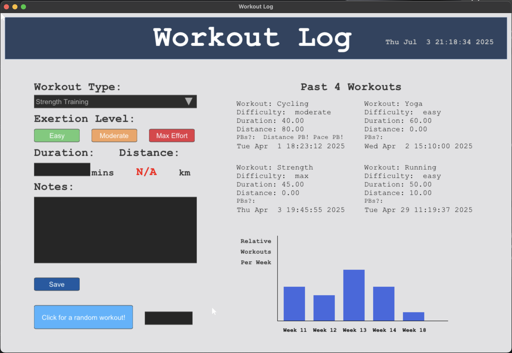

# TDT4102 workout log project

This program functions as a simple training log, with a graphical user interface. The user can enter information about their last training session, including type of training, effort level, duration, distance and any 
additional notes. Furthermore, the date is automatically collected. This information is then saved and collected the next time users run the program. The program displays an overview of the last four training sessions 
that the user has performed, and a bar graph showing how much the user has trained in the last 5 weeks. The distance input box is disabled for workouts that do not require much cardio/where distance is not important, 
such as strength training or yoga. There is also a simple PB system that checks if a workout has the longest distance, duration or pace. This is displayed on the screen. An additional small feature is that the user 
can generate a random workout if they are unsure of what to do.

